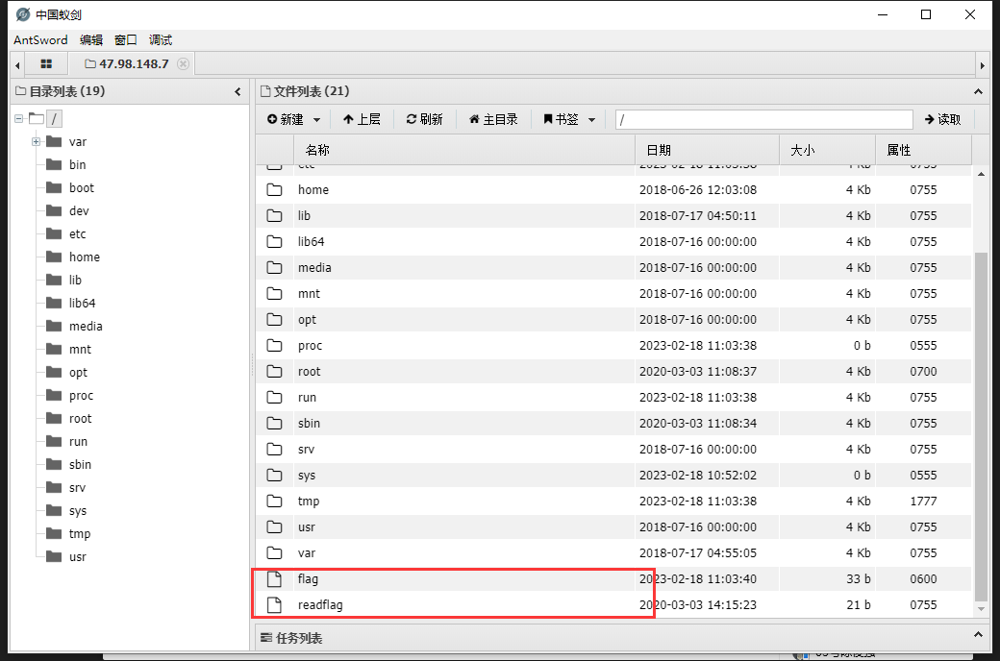

  <div align="center">
 
 <p align="center">
 
 
 
  
 
 
 </p>
  
 
  
  
   
 <table>
  <tr>
      <th>Function</th>
  </tr>
  <tr>
    <th>LD_ PRLAOD function hijacking (Web hijacking)</th>
  </tr>
  <tr>
    <th>LD_ PRLAOD function hijacking (EXE executable hijacking)</th>
  </tr>
 </table>
</div>

## usage method

 * View help information

      ```#python3 Mole.py -h```

    
  
## Web remote command execution

1.Connect to the server,Because Flag is invisible to us, we need to bypass permission reading

  
  

2.Upload a file to read Flag beyond authority

  

3.After accessing the php page, our Flag is generated in the tmp directory

  

## Executable reverse shell

1.Generate malicious shared libraries
  
Complete the reverse connection IP and port

2.Compile the c file

``gcc Main.c -o Main``

_You can use the example in the ```Main.c``` file. This time the Printf function is hijacked. If you need to hijack other functions, please modify the code in ```Hijacking-source.c```_


  


3.Send the following files to the target: ```Loading.sh``` ```Main``` ```Hijacking-OutputNew.so```


_When the user runs ```. ./Loading.sh ```automatically loads the code. We can see that the printf function is hijacked and a reverse shell is opened_

  
  


